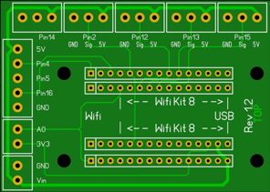
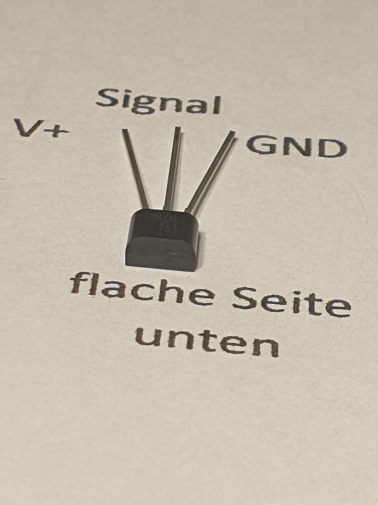

# Aufbau und Einbau der Hardware
{: .no_toc }

Inhaltsverzeichnis

* TOC
{:toc}

## Trockenaufbau

Wenn ihr die einzelnen Komponenten beisammenhabt, startet ihr am besten mit einem Trockenaufbau außerhalb eurer Maschine. So könnt ihr das System zum Laufen bringen und kommt jederzeit problemlos an alle Stecker etc. heran.

Die Heizung eurer Maschine könnt ihr z. B. mit einer Glühbirne simulieren, jeder andere 230V Verbraucher tut es aber genauso gut.

*(1=Mikrocontroller, 2=Temperatursensor, 3=SSR Relais für Heizung, 4=Schaltnetzteil, 5=Display)*

Das PCB für den (neuern) Mikrocontroller ESP32 sieht wie folgt aus:

Das PCB für den (älteren) Mikrocontroller ESP8266 sieht wie folgt aus:

##  PIN Belegung vom PCB ESP8266

Die einzelnen Komponenten werden wie folgt angeschlossen:

PIN | Belegung
-|-
PIN 14 | SSR Heizung     
PIN 2 | Temperatursensor
PIN 4 | Display-PIN SDA
PIN 5 | Display-PIN SCL
GND/Vin | Netzteil

### Vollausbau

Bei dem „Vollausbau“ wird noch die Steuerung für Magnetventil und Pumpe benötigt:

PIN | Belegung
-|-
PIN 12 | Relais Ansteuerung Magnetventil
PIN 13 | Relais Ansteuerung Pumpe

## Einbau

### Temperatursensor anschließen

**ACHTUNG!!** Aktuell kann es sein, dass der TSIC mit einem falschen Datenblatt ausgeliefert wird. Hier wird die Polung falsch angegeben.

Besondere Sorgfalt müsst ihr bitte beim Anschließen des Temperatursensors TSIC 306 walten lassen: sobald dieser einmal falsch angeschlossen Spannung bekommen hat, ist er entweder sofort zerstört oder zumindest vorgeschädigt und liefert dadurch fehlerhafte Messwerte. Daher ist es immer ratsam einen Ersatz-Sensor parat zu haben.

* Sensor V+ : Board PIN 2 5V
* Sensor Signal: Board PIN 2 Signal
* Sensor GND:  Board PIN 2 GND

Wie ihr zu der Beschreibung zum Board sehen könnt, muss an Pin 2 der Temperatursensor angeschlossen werden. Die oberen Ports (14, 2, 12, 13, 15) sind einheitlich jeweils von links nach rechts mit Minus(-), Signal, 5V(+) belegt.

Da wir öfters hören, dass die mitgelieferte Bildbeschreibung des TSIC nicht gut ist, haben wir hier nochmals die Pins vom Sensor dargestellt. Die flache Seite liegt unten. Ein falsch gepolter TSIC sollte entsorgt werden! Er misst vermeintlich richtig, aber definitiv nicht mehr genau.

Beim Anschließen des SSR zur Ansteuerung der Heizung ist es wichtig, dass die Polarität der SSR-Ports 3 und 4 beachtet werden:

* SSR Port 3 (+) : Board PIN 14 Signal
* SSR Port 4 (-) : Board PIN 14 GND

Damit habt ihr das System zum ersten Mal aufgebaut.

### PIN Belegung vom PCB

Pin|Funktion
-|-
Pin 12| Relay für das Ventil
Pin 13| Relay für die Pumpe
Pin 15| Schalter Brühtaste
Pin 14| Relay für die Heizung
Pin 2| Temperatursensor
A0| Drucksensor
Pin 4| SDA
Pin 5| SCL
Pin 16| E-Trigger Standby Trigger Silvia E

## Tipps und Tricks

Hier einige gesammelte Hinweise zum Einbau in die Maschine:

* Verbaut die Komponenten an einem trockenen Ort und möglichst entfernt von der Hitzequelle Boiler.

* Das SSR schaltet die Heizleistung von ca. 1.000 W, von daher kann eine Montage mit wärmeleitendem Kleber bzw. Klebepads nicht schaden.

*  Den Temperatursensor solltet ihr wenn möglich nicht nur an den Kessel ankleben, sondern fest verschrauben. Bei der Rancilio Silvia kann man dazu die Halteklammer des nun überflüssigen Brühthermostaten nutzen, bei der Gaggia Classic kann der Sensor am vorhandenen M4-Gewinde der Thermostataufnahme verschraubt werden.

* Zum Anschluss des Temperatursensors TSIC keine Steckverbinder (Jumperkabel) nehmen, sondern Litze an die Beine des TSIC löten. Das ist etwas fummelig, aber dafür habt ihr weniger Neigung zu Wackelkontakten im verbauten Zustand.

* Beim ersten Probelauf nach dem erfolgreichen Zusammenbau muss der PID einmalig über die Konfigurationshomepage aktiviert werden, ansonsten zeigt das Display nur "PID is disabled manually" an. Danach sollte das Relais schalten und "heizen". 
