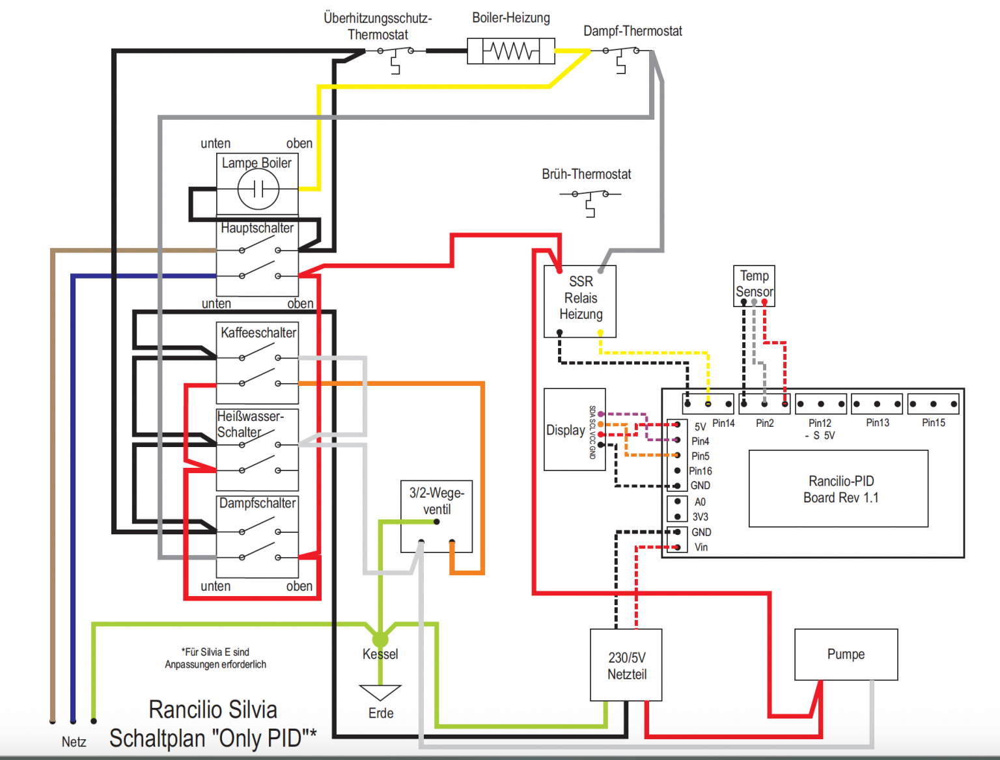
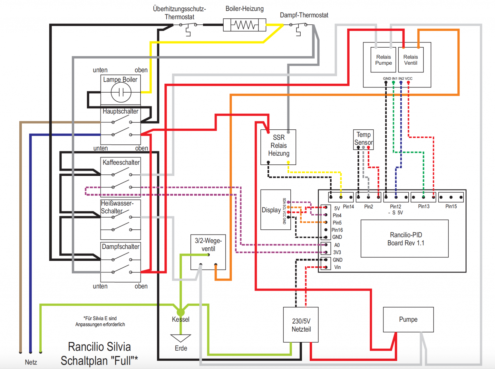

# Wiring Diagrams
{: .no_toc }

Contents

* TOC
{:toc}

## Warning

> {{ site.warning.en }}

## Introduction

If the previous tests were successful, let's start with putting everything in the coffee machine's case. Independent of the type of expansion you chose, you'll have to supply the switching power supply and microcontroller with electricity, and fix the temperature sensor onto the boiler.
This page will guide you through these steps using the example of the Rancilio Silvia. Other machines, like the Gaggia, have been modified successfully in the past as well.

## Rancilio

### Original Wiring Diagram

The first wiring diagram shows the original configuration of the Silvia prior to any modification.

### Only PID

The second wiring diagram shows the "Pid Only" modification.
This version only manages the heating with the help of the temperature sensor.
The pump and 3-way-valve are not controlled by the ESP microcontroller.

### Only PID+

A wiring diagram for OnlyPID+, including an optocoupler for brew detection, does not yet exist.
Based on the wiring diagram of the OnlyPID above, the OnlyPID+ variant adds an optocoupler parallel to the brew switch and the 3-way-valve.

### Full Expansion

The third wiring diagram shows the current "full expansion". This version includes a temperature sensor on the boiler. Additionally, it can also control the brew time duration and do a pre-infusion (feeding some water into the portafilter, break, brew like normal).
In this version, both the pump and the 3-way-valve are controlled by the ESP microcontroller.

**IMPORTANT NOTE: This modification on the brew-switch can only be done if a switch without a lamp is used, or if the lamp is taken out of the lamp, or if you re-wire the lamp to use only 3.3 Volts (see [LED-Mod](./led-mod). Otherwise, there is NO galvanic separation between 3.3 Volts and 120/230 Volts! This can possibly be a danger to you or the microcontroller!**

